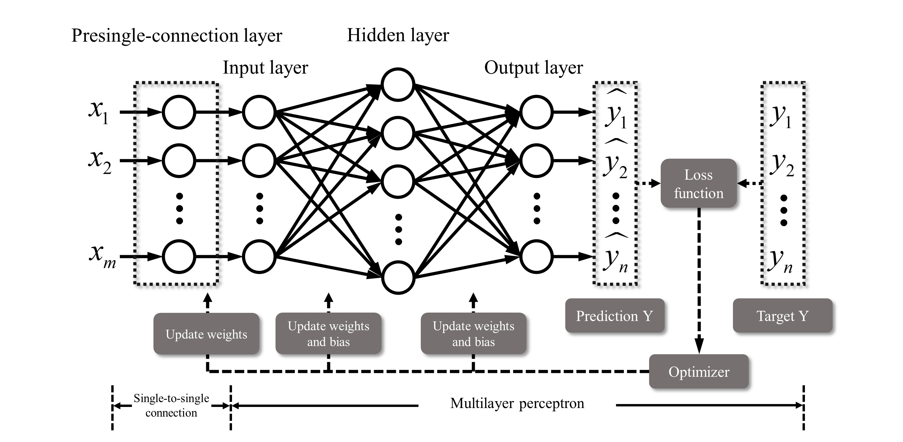

# SMLP-multilayer-perceptron-with-a-presingle-connection-layer

Zhang, W., Shen, X., Zhang, H. et al. Feature importance measure of a multilayer perceptron based on the presingle-connection layer. Knowl Inf Syst 66, 511–533 (2024). https://doi.org/10.1007/s10115-023-01959-7

Linear classification simulations in the paper can be found in the folder "Linear classification simulation example".

Linear regression simulations in the paper can be found in the folder "Linear regression simulation example".
